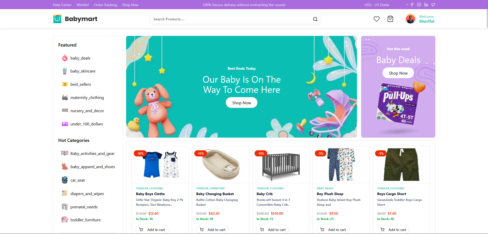
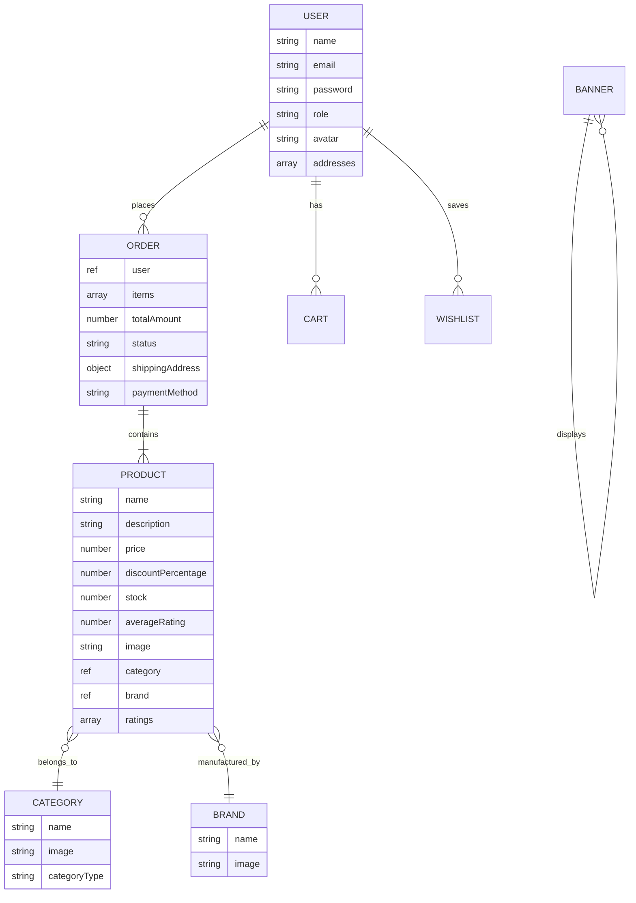

<p align="center">
  
</p>

<h1 align="center">🍼 BabyMart — Full-Stack E-Commerce Platform</h1>

<p align="center">
  <strong>A modern, production-ready e-commerce platform for baby & children's products</strong><br/>
  Built with Next.js 16, Express 5, MongoDB, and a dedicated Admin Dashboard
</p>

<p align="center">
  
  
  
  
  
  
  
  
</p>

<p align="center">
  
</p>

---

## 📋 Table of Contents

- [Overview](#-overview)
- [Live Demo](#-live-demo)
- [Architecture](#️-architecture)
- [Tech Stack](#-tech-stack)
- [Features](#-features)
- [Project Structure](#-project-structure)
- [Getting Started](#-getting-started)
- [Environment Variables](#-environment-variables)
- [API Reference](#-api-reference)
- [Performance Optimizations](#-performance-optimizations)
- [Deployment](#-deployment)
- [Screenshots](#-screenshots)
- [Author](#-author)

---

## 🌟 Overview

**BabyMart** is a complete, full-stack e-commerce solution specifically designed for baby and children's products. The platform consists of three independently deployable applications:

| Application | Technology | Purpose |
|:---|:---|:---|
| **Client (Storefront)** | Next.js 16 + React 19 | Customer-facing shopping experience |
| **Admin Dashboard** | Vite + React 19 | Business management & analytics |
| **API Server** | Express 5 + MongoDB | RESTful API backend with Swagger docs |

The platform supports the complete e-commerce lifecycle — from product browsing and cart management to checkout via Stripe, order tracking, and administrative oversight.

---

## 🔗 Live Demo

| App | URL |
|:---|:---|
| 🛒 **Client Store** | [babymart-e-commerce-client.vercel.app](https://babymart-e-commerce-client.vercel.app) |
| 📊 **Admin Dashboard** | [babymart-e-commerce-dashboard.vercel.app](https://babymart-e-commerce-dashboard.vercel.app) |
| 🔌 **API Server** | Deployed on Vercel (Serverless) |
| 📚 **API Docs** | `/api/docs` (Swagger UI) |

---

## 🏗️ Architecture

```
┌─────────────────────────────────────────────────────────────────┐
│                        DEPLOYMENT (Vercel)                      │
├────────────────┬────────────────┬───────────────────────────────┤
│                │                │                               │
│  ┌──────────┐  │  ┌──────────┐  │  ┌───────────────────────┐    │
│  │  Client  │  │  │  Admin   │  │  │     API Server        │    │
│  │ Next.js  │──┼──│  Vite    │──┼──│  Express 5            │    │
│  │  16.2    │  │  │  React   │  │  │  ┌─────────────────┐  │    │
│  │          │  │  │          │  │  │  │   MongoDB Atlas  │  │    │
│  └──────────┘  │  └──────────┘  │  │  └─────────────────┘  │    │
│                │                │  │  ┌─────────────────┐  │    │
│                │                │  │  │   Cloudinary     │  │    │
│                │                │  │  └─────────────────┘  │    │
│                │                │  │  ┌─────────────────┐  │    │
│                │                │  │  │   Stripe API     │  │    │
│                │                │  │  └─────────────────┘  │    │
│                │                │  └───────────────────────┘    │
└────────────────┴────────────────┴───────────────────────────────┘
```

---

## 🛠 Tech Stack

### Client (Storefront)

| Category | Technology |
|:---|:---|
| Framework | Next.js 16 (App Router + Turbopack) |
| Language | TypeScript 5.9 |
| UI Library | React 19 |
| Styling | Tailwind CSS 4 |
| State Management | Zustand 5 |
| Forms | React Hook Form + Zod validation |
| Animations | Framer Motion |
| Icons | Lucide React |
| Payments | Stripe.js |
| UI Components | Radix UI Primitives (Dialog, Select, Tabs, etc.) |
| Notifications | Sonner |
| Auth | JWT (custom implementation) |

### Admin Dashboard

| Category | Technology |
|:---|:---|
| Build Tool | Vite 7 |
| Language | TypeScript 5.8 |
| UI Library | React 19 |
| Styling | Tailwind CSS 4 |
| Routing | React Router 7 |
| State Management | Zustand 5 |
| Charts | Recharts 3 |
| HTTP Client | Axios |
| Forms | React Hook Form + Zod |
| File Upload | React Dropzone |
| Printing | React To Print |

### API Server (Backend)

| Category | Technology |
|:---|:---|
| Runtime | Node.js |
| Framework | Express 5.1 |
| Database | MongoDB (Mongoose 8) |
| Authentication | JWT + bcryptjs |
| File Storage | Cloudinary |
| Payments | Stripe |
| Email | Nodemailer |
| API Docs | Swagger (swagger-jsdoc + swagger-ui-express) |
| Compression | gzip (compression middleware) |

---

## ✨ Features

### 🛒 Customer Storefront

#### Shopping Experience
- **Dynamic Homepage** — Hero banners, trending products, new arrivals, best deals, seasonal promotions, and stock clearance sections
- **Smart Search** — Real-time autocomplete with debounced API calls and trending search suggestions
- **Product Catalog** — Advanced filtering by category, brand, and price range with pagination
- **Product Details** — Full product pages with image zoom, ratings, descriptions, and related products
- **Category Sidebar** — Featured categories, hot categories, quick links, shop-by-age groups, and special offers

#### Cart & Checkout
- **Persistent Cart** — Add/remove items with quantity management (syncs with backend for logged-in users)
- **Wishlist** — Save products for later with heart icon toggle
- **Stripe Checkout** — Secure payment processing via Stripe integration
- **Order Success** — Post-checkout confirmation with order ID and tracking info
- **Order History** — View all past orders with detailed order breakdown

#### User Account
- **Registration & Login** — JWT-based authentication with form validation
- **Profile Management** — Update personal information and profile image
- **Address Book** — Manage multiple shipping addresses with default selection
- **Order Tracking** — Monitor order status from processing to delivery

#### Customer Support Hub
- **Help Center** (`/help`) — Central FAQ page with category navigation cards
- **Shipping Info** (`/help/shipping`) — Tiered shipping options, process flow, and tracking guide
- **Returns & Exchanges** (`/help/returns`) — 30-day return policy, step-by-step return process, non-returnable items
- **Contact Us** (`/help/contact`) — Contact info cards with validated contact form and toast notifications

#### Information Pages
- **About Us** (`/about`) — Company story, mission, and value propositions
- **Privacy Policy** (`/privacy`) — Data collection and usage policies
- **Terms of Service** (`/terms`) — Legal terms and conditions

### 📊 Admin Dashboard

- **Analytics Dashboard** — Revenue charts, order statistics, and KPI cards (Recharts)
- **Product Management** — Full CRUD with Cloudinary image upload, discount percentages, stock tracking
- **Category Management** — Create/edit categories with image upload and category types (Featured / Hot)
- **Brand Management** — Create/edit brands with logo upload
- **Banner Management** — Manage promotional banners with type classification
- **Order Management** — View all orders, update order status, track fulfillment
- **User Management** — View registered users, manage roles (admin/user)
- **Invoice Generation** — Print-ready invoices via React To Print
- **Account Settings** — Admin profile management
- **Responsive Sidebar** — Collapsible sidebar with active route highlighting

### 🔌 API Server

- **RESTful Architecture** — Clean separation of routes, controllers, and models
- **12 API Modules** — Auth, Users, Products, Categories, Brands, Banners, Orders, Cart, Wishlist, Stats, Analytics, Payments
- **JWT Authentication** — Bearer token with role-based access control (user / admin)
- **Swagger Documentation** — Interactive API docs at `/api/docs`
- **Database Indexing** — Optimized indexes on product fields (category, brand, price, text search)
- **Gzip Compression** — Response compression for reduced bandwidth
- **CORS Configuration** — Environment-aware origin whitelisting
- **Error Handling** — Centralized error middleware with async handler

---

## 📁 Project Structure

```
babyshop-ecommerce/
├── client/                          # Next.js 16 Storefront
│   ├── src/
│   │   ├── app/                     # App Router pages
│   │   │   ├── page.tsx             # Homepage (Server Component)
│   │   │   ├── shop/                # Product catalog with filters
│   │   │   ├── product/[id]/        # Dynamic product details
│   │   │   ├── search/              # Search page
│   │   │   ├── auth/                # Sign in / Sign up
│   │   │   ├── user/                # Cart, Checkout, Orders, Profile, Wishlist
│   │   │   ├── help/                # Help Center, Shipping, Returns, Contact
│   │   │   ├── success/             # Post-checkout confirmation
│   │   │   ├── about/               # About page
│   │   │   ├── privacy/             # Privacy policy
│   │   │   ├── terms/               # Terms of service
│   │   │   └── api/                 # API routes (Stripe checkout)
│   │   ├── components/
│   │   │   ├── auth/                # Login/Register forms
│   │   │   ├── common/              # ProductCard, PriceContainer, etc.
│   │   │   ├── header/              # TopHeader, MainHeader, Sidebar, Search
│   │   │   ├── footer/              # Footer with nav links
│   │   │   ├── home/                # Homepage sections (10 components)
│   │   │   ├── pages/               # Page-specific client components
│   │   │   ├── providers/           # Context providers
│   │   │   ├── skeleton/            # Loading skeletons
│   │   │   └── ui/                  # Radix-based UI primitives
│   │   ├── lib/                     # API config, stores, utilities
│   │   │   ├── store.ts             # Zustand stores (cart, user, currency)
│   │   │   ├── config.ts            # API base URL + fetch wrapper
│   │   │   ├── authApi.ts           # Auth API functions
│   │   │   ├── cartApi.ts           # Cart sync API
│   │   │   ├── orderApi.ts          # Order management API
│   │   │   ├── wishlistApi.ts       # Wishlist API
│   │   │   └── stripe.ts            # Stripe client config
│   │   ├── types/                   # TypeScript interfaces
│   │   └── constants/               # Static data & navigation
│   └── package.json
│
├── admin/                           # Vite + React Admin Dashboard
│   ├── src/
│   │   ├── pages/                   # Dashboard, Products, Categories, etc.
│   │   ├── components/              # Sidebar, Header, shared components
│   │   ├── store/                   # Zustand auth store
│   │   ├── hooks/                   # Custom hooks
│   │   └── lib/                     # Utilities
│   └── package.json
│
├── server/                          # Express 5 API Server
│   ├── index.js                     # Server entry point
│   ├── config/
│   │   ├── db.js                    # MongoDB connection
│   │   ├── cloudinary.js            # Cloudinary config
│   │   └── swagger.js               # Swagger/OpenAPI setup
│   ├── models/                      # Mongoose schemas (7 models)
│   │   ├── userModel.js
│   │   ├── productModel.js
│   │   ├── categoryModel.js
│   │   ├── brandModel.js
│   │   ├── bannerModel.js
│   │   ├── orderModel.js
│   │   └── cartModel.js
│   ├── controllers/                 # Business logic (12 controllers)
│   ├── routes/                      # API route definitions (12 routes)
│   ├── middleware/
│   │   ├── authMiddleware.js         # JWT protect + admin guard
│   │   └── errorMiddleware.js        # Global error handler
│   ├── utils/                       # Helper utilities
│   └── package.json
```

---

## 🚀 Getting Started

### Prerequisites

- **Node.js** ≥ 18.x
- **MongoDB** (local instance or [MongoDB Atlas](https://www.mongodb.com/atlas))
- **Cloudinary** account ([cloudinary.com](https://cloudinary.com))
- **Stripe** account ([stripe.com](https://stripe.com))

### Installation

```bash
# 1. Clone the repository
git clone https://github.com/your-username/babyshop-ecommerce.git
cd babyshop-ecommerce

# 2. Install server dependencies
cd server
npm install

# 3. Install client dependencies
cd ../client
npm install

# 4. Install admin dependencies
cd ../admin
npm install
```

### Running Locally

Open three terminal windows:

```bash
# Terminal 1 — API Server (port 8000)
cd server
npm run dev

# Terminal 2 — Client Storefront (port 3000)
cd client
npm run dev

# Terminal 3 — Admin Dashboard (port 5173)
cd admin
npm run dev
```

### Building for Production

```bash
# Client
cd client
npm run build    # Outputs to .next/

# Admin
cd admin
npm run build    # Outputs to dist/

# Server (no build step — runs directly with Node.js)
cd server
npm start
```

---

## 🔐 Environment Variables

### Server (`server/.env`)

```env
# Database
MONGO_URI=mongodb+srv://<user>:<pass>@cluster.mongodb.net/babymart

# Authentication
JWT_SECRET=your_jwt_secret_key

# Cloudinary (Image uploads)
CLOUDINARY_CLOUD_NAME=your_cloud_name
CLOUDINARY_API_KEY=your_api_key
CLOUDINARY_API_SECRET=your_api_secret

# Stripe (Payments)
STRIPE_SECRET_KEY=sk_test_xxxx

# CORS Origins
CLIENT_URL=http://localhost:3000
ADMIN_URL=http://localhost:5173

# Environment
NODE_ENV=development
PORT=8000
```

### Client (`client/.env`)

```env
# API Endpoint
NEXT_PUBLIC_API_URL=http://localhost:8000/api

# Stripe Public Key
NEXT_PUBLIC_STRIPE_PUBLISHABLE_KEY=pk_test_xxxx
```

### Admin (`admin/.env`)

```env
# API Endpoint
VITE_API_URL=http://localhost:8000/api
```

---

## 📡 API Reference

The API is fully documented with Swagger. After starting the server, visit:

```
http://localhost:8000/api/docs
```

### Core Endpoints

| Method | Endpoint | Auth | Description |
|:---|:---|:---|:---|
| **Auth** | | | |
| `POST` | `/api/auth/register` | ❌ | Register a new user |
| `POST` | `/api/auth/login` | ❌ | Login and receive JWT |
| **Products** | | | |
| `GET` | `/api/products` | ❌ | List products (paginated, filterable) |
| `GET` | `/api/products/:id` | ❌ | Get single product |
| `POST` | `/api/products` | 🔒 Admin | Create product |
| `PUT` | `/api/products/:id` | 🔒 Admin | Update product |
| `DELETE` | `/api/products/:id` | 🔒 Admin | Delete product |
| **Categories** | | | |
| `GET` | `/api/categories` | ❌ | List all categories |
| `POST` | `/api/categories` | 🔒 Admin | Create category |
| **Brands** | | | |
| `GET` | `/api/brands` | ❌ | List all brands |
| `POST` | `/api/brands` | 🔒 Admin | Create brand |
| **Cart** | | | |
| `GET` | `/api/cart` | 🔒 User | Get user's cart |
| `POST` | `/api/cart/add` | 🔒 User | Add item to cart |
| `DELETE` | `/api/cart/remove` | 🔒 User | Remove from cart |
| **Orders** | | | |
| `POST` | `/api/orders` | 🔒 User | Place a new order |
| `GET` | `/api/orders/user/:id` | 🔒 User | Get user's orders |
| `PUT` | `/api/orders/:id` | 🔒 Admin | Update order status |
| **Wishlist** | | | |
| `GET` | `/api/wishlist` | 🔒 User | Get wishlist |
| `POST` | `/api/wishlist` | 🔒 User | Toggle wishlist item |
| **Payments** | | | |
| `POST` | `/api/payment` | 🔒 User | Create Stripe payment intent |
| **Analytics** | | | |
| `GET` | `/api/analytics` | 🔒 Admin | Dashboard analytics data |
| `GET` | `/api/stats` | 🔒 Admin | Summary statistics |

### Query Parameters (Products)

```
GET /api/products?page=1&limit=10&search=stroller&category=<id>&brand=<id>&priceMin=10&priceMax=50&sortOrder=desc
```

---

## ⚡ Performance Optimizations

### Backend
- **Gzip Compression** — `compression` middleware reduces JSON response sizes by ~80%
- **MongoDB Indexes** — Compound indexes on `category`, `brand`, `price`, and `createdAt` fields
- **Text Search Index** — Full-text index on `name` + `description` for fast search
- **Lean Queries** — `.lean()` on all read queries skips Mongoose hydration for faster responses
- **Parallel Queries** — `Promise.all()` for concurrent `count` + `find` operations

### Frontend
- **Server Components** — Homepage sections fetched and rendered on the server (zero client JS for product lists)
- **React Suspense Streaming** — Sections stream to the browser as data becomes available
- **Turbopack** — Next.js dev server uses Turbopack for instant HMR
- **Optimized Images** — Next.js `<Image>` with lazy loading and appropriate `width`/`height`
- **Debounced Search** — 300ms debounce on search input prevents excessive API calls
- **Zustand** — Lightweight state management (~1KB) with persistence via localStorage
- **Code Splitting** — Automatic route-based code splitting via Next.js App Router

### Build Output

```
Route (app)                       Revalidate  Expire
┌ ○ /                                    ≈2m      1y    ← ISR cached
├ ○ /shop                                ≈2m      1y    ← ISR cached
├ ƒ /product/[id]                                       ← Dynamic SSR
├ ○ /help                                               ← Static
├ ○ /help/shipping                                      ← Static
├ ○ /help/returns                                       ← Static
├ ○ /help/contact                                       ← Static
└ ○ /about                                              ← Static

○ = Static (prerendered at build)
ƒ = Dynamic (rendered on demand)
```

---

## 🚢 Deployment

All three apps are deployed on **Vercel**:

### Client (Next.js)
```bash
cd client
vercel --prod
```

### Admin (Vite SPA)
```bash
cd admin
vercel --prod
```
> Note: `admin/vercel.json` includes SPA rewrite rules for client-side routing.

### Server (Serverless)
```bash
cd server
vercel --prod
```
> Note: `server/vercel.json` configures the Express app as a serverless function.

---

## 🗄 Database Schema



---

## 🖼 Screenshots

### Client Pages
| Page | Route | Description |
|:---|:---|:---|
| 🏠 Homepage | `/` | Hero banners, trending products, new arrivals, vendor promo |
| 🛍️ Shop / Catalog | `/shop` | Product grid with category, brand, price filters |
| 📦 Product Details | `/product/:id` | Full product page with ratings and related items |
| 🛒 Cart | `/user/cart` | Itemized cart with quantity controls |
| 💳 Checkout | `/user/checkout` | Stripe-powered secure checkout |
| 📋 Order History | `/user/orders` | Past orders with status tracking |
| ❓ Help Center | `/help` | FAQ, category cards for support navigation |
| 🚚 Shipping Info | `/help/shipping` | Shipping tiers and delivery process |
| ↩️ Returns | `/help/returns` | 30-day return policy and step-by-step guide |
| 📞 Contact Us | `/help/contact` | Contact form with validation |

### Admin Pages
| Page | Route |
|:---|:---|
| Dashboard Analytics | `/` |
| Product Management | `/products` |
| Category Management | `/categories` |
| Brand Management | `/brands` |
| Banner Management | `/banners` |
| Order Management | `/orders` |
| User Management | `/users` |
| Invoice Viewer | `/invoices` |

---

## 👤 Author

**shoriful-dev**

---

## 📄 License

This project is licensed under the **ISC License**.

---

<p align="center">
  Made with ❤️ for parents and babies everywhere
</p>
